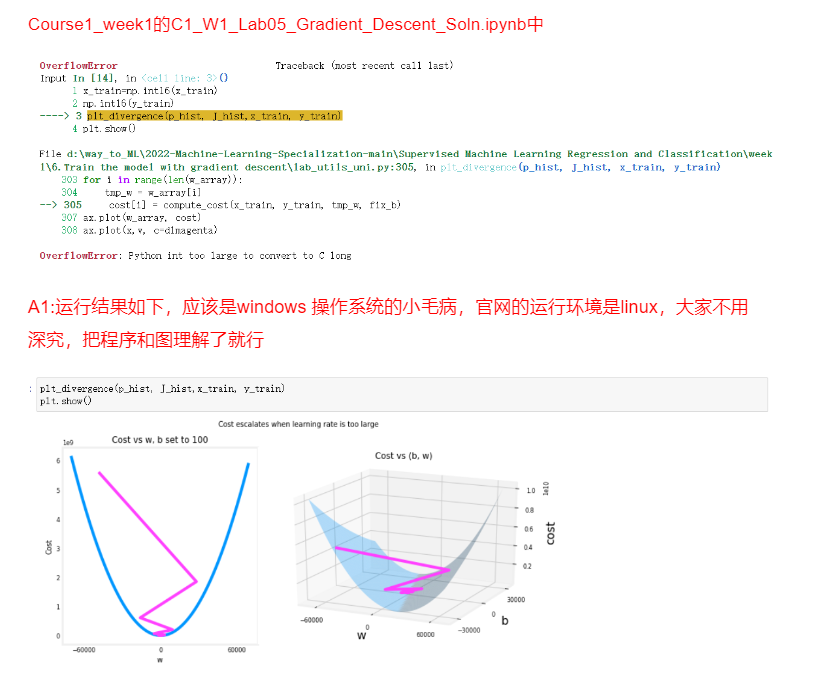

In the optional lab, you’ll see a review of the gradient descent algorithm, as well as how to implement it in code.

You will also see a plot that shows how the cost decreases as you continue training more iterations.  And you’ll also see a contour plot, seeing how the cost gets closer to the global minimum as gradient descent finds better and better values for the parameters w and b.

**2023/6/7说明**：严格来讲倒不是win的小毛病，是pandas默认使用int作为数据类型，所以就溢出了。
